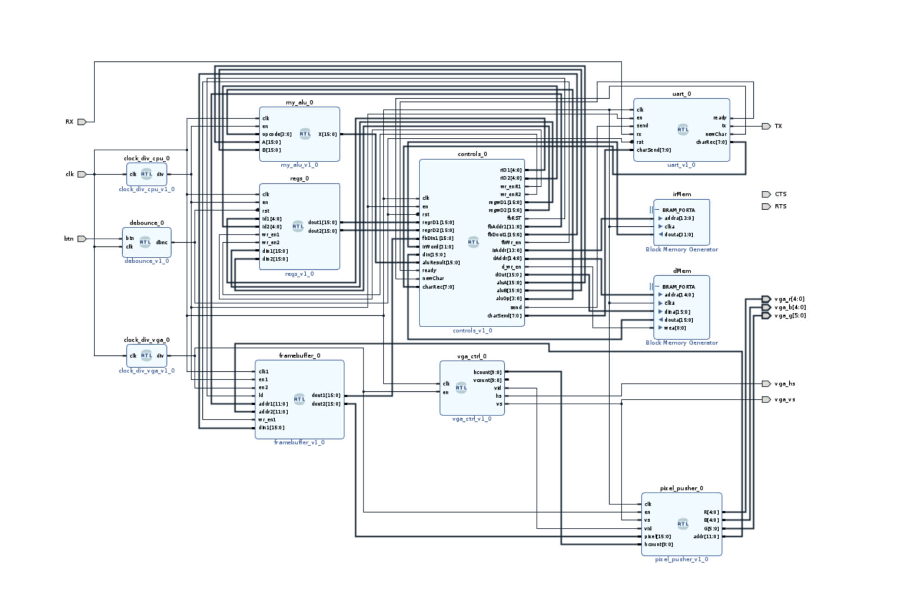
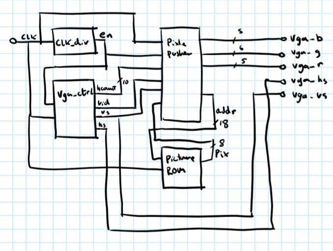
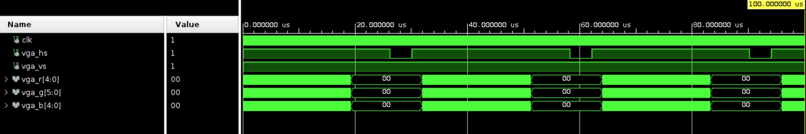
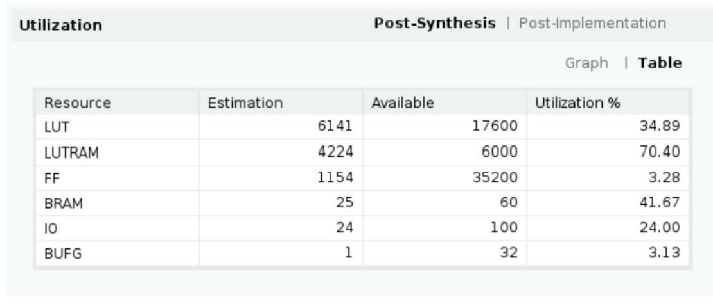
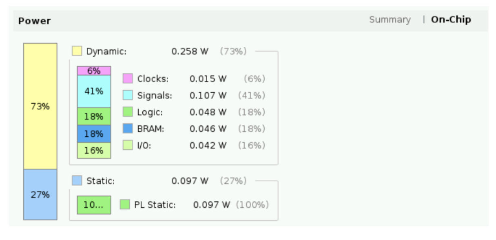

# Embedded VGA Controller

A fully synthesizable VGA controller implemented in VHDL for FPGA platforms. This project generates a 640x480 @ 60Hz VGA signal with a test pattern, demonstrating digital video timing generation, pixel data management, and color output.

## Overview

This project implements a complete VGA display controller using VHDL. It includes a clock divider, VGA timing controller, pixel pusher, and picture ROM to generate a video signal compatible with standard VGA monitors. The design is targeted for Xilinx FPGAs and includes simulation testbenches for verification.

## Features

- **640x480 @ 60Hz VGA Output**: Standard VGA resolution with proper horizontal and vertical sync timing
- **16-bit Color Depth**: 5-bit Red, 6-bit Green, 5-bit Blue (RGB565) color output
- **Test Pattern Generation**: Built-in checkerboard pattern for immediate visual verification
- **Block RAM Image Storage**: COE-based ROM initialization for custom image data
- **Modular Design**: Clean separation of concerns between timing, pixel processing, and clock domains
- **Simulation Ready**: GHDL-compatible testbenches with VCD waveform output

## Architecture

The VGA controller is built from four main components orchestrated by a top-level wrapper:

| Component      | Description                                                           |
| -------------- | --------------------------------------------------------------------- |
| `clock_div`    | Divides the system clock (125 MHz) down to the 25 MHz pixel clock     |
| `vga_ctrl`     | Generates VGA timing signals (HSYNC, VSYNC) and pixel coordinates     |
| `pixel_pusher` | Maps pixel data to RGB outputs and manages frame buffer addressing    |
| `picture`      | Block ROM storing 8-bit indexed pixel data (expandable to full image) |

### Top-Level Block Diagram



### System Block Diagram



### Signal Flow

1. **Clock Division**: The 125 MHz system clock is divided by 5 to produce a 25 MHz pixel clock enable
2. **Timing Generation**: `vga_ctrl` maintains horizontal/vertical counters and generates sync pulses
3. **Address Generation**: `pixel_pusher` converts (x,y) coordinates into linear ROM addresses
4. **Color Expansion**: 8-bit indexed pixels are expanded to 16-bit RGB565 color values
5. **Output**: VGA HSYNC, VSYNC, and RGB signals drive the display

## File Structure

```
embedded-vga-controller/
├── src/
│   ├── image_top.vhd          # Top-level design entity
│   ├── vga_ctrl.vhd           # VGA timing controller
│   ├── pixel_pusher.vhd       # Pixel data and RGB output
│   ├── clock_div.vhd          # Clock divider (125 MHz -> 25 MHz)
│   ├── picture.vhd            # Image ROM (test pattern)
│   ├── picture.coe            # COE file for BRAM initialization
│   ├── vga_ctrl_tb.vhd        # VGA controller testbench
│   ├── image_top_tb.vhd       # Top-level integration testbench
│   ├── make.bat               # GHDL compilation script
│   ├── check.bat              # VHDL syntax check script
│   └── view.bat               # GTKWave launcher
└── assets/
    ├── block_diagram_drawing.png   # Hand-drawn system block diagram
    ├── top_block_diagram.png       # RTL block diagram
    ├── image_top_tb.png            # Simulation waveform screenshot
    ├── post_synthesis_utilization_table.png  # FPGA resource usage
    └── on_chip_power_graph.png    # Power estimation results
```

## VGA Timing Specifications

The controller implements standard 640x480 @ 60Hz VGA timing:

| Parameter              | Value                                 |
| ---------------------- | ------------------------------------- |
| Pixel Clock            | 25.175 MHz (approximated with 25 MHz) |
| Horizontal Resolution  | 640 pixels                            |
| Horizontal Front Porch | 16 pixels                             |
| Horizontal Sync Pulse  | 96 pixels                             |
| Horizontal Back Porch  | 48 pixels                             |
| Horizontal Total       | 800 pixels                            |
| Vertical Resolution    | 480 lines                             |
| Vertical Front Porch   | 10 lines                              |
| Vertical Sync Pulse    | 2 lines                               |
| Vertical Back Porch    | 33 lines                              |
| Vertical Total         | 525 lines                             |
| Refresh Rate           | 60 Hz                                 |

## Getting Started

### Prerequisites

- [GHDL](https://github.com/ghdl/ghdl) - Open-source VHDL simulator
- [GTKWave](https://gtkwave.sourceforge.net/) - Waveform viewer
- Xilinx Vivado (optional, for synthesis and FPGA programming)
- FPGA board with VGA output (e.g., Zybo Z7, Nexys A7, Basys 3)

### Simulation

Run the testbench to verify timing and signal generation:

```batch
:: Navigate to the source directory
cd src

:: Run the top-level testbench (compiles, elaborates, and simulates)
make.bat

:: View the waveform results
gtkwave sim.vcd
```

The `make.bat` script performs three steps:
1. **Analysis**: `ghdl -a` compiles all VHDL source files
2. **Elaboration**: `ghdl -e` builds the testbench executable
3. **Simulation**: `ghdl -r` runs the simulation and outputs `sim.vcd`

### Synthesis

To synthesize for a Xilinx FPGA:

1. Create a new Vivado project targeting your FPGA part
2. Add all VHDL files from `src/` (excluding testbenches and `.bat` files)
3. Add the `picture.coe` file as a memory initialization source
4. Set `image_top` as the top module
5. Add XDC constraints for your board's VGA connector pins
6. Run synthesis and implementation

### Pin Mapping (Zybo Z7 Example)

| Signal | FPGA Pin | Description |
|--------|----------|-------------|
| `clk` | K17 | 125 MHz system clock |
| `vga_hs` | V15 | VGA horizontal sync |
| `vga_vs` | W15 | VGA vertical sync |
| `vga_r[4:0]` | V16, W16, T17, T15, V13 | Red channel |
| `vga_g[5:0]` | W13, V12, U12, T12, T10, T11 | Green channel |
| `vga_b[4:0]` | W14, Y14, T14, T15, V13 | Blue channel |

*Note: Update pin assignments based on your specific FPGA board.*

## Simulation Results

### Top-Level Testbench Waveform

The `image_top_tb` testbench verifies the complete signal chain from clock input to VGA output:



Key signals to observe:
- `clk`: 125 MHz system clock
- `vga_hs` / `vga_vs`: Horizontal and vertical sync pulses
- `vga_r`, `vga_g`, `vga_b`: Color outputs active during visible region

## Synthesis Results

### Resource Utilization

Post-synthesis resource utilization on a Xilinx Artix-7 FPGA:



The design is lightweight and fits comfortably in even the smallest Zynq-7000 devices.

### Power Estimation

On-chip power consumption estimate:



Total power is dominated by static/leakage power due to the low operating frequency and minimal logic utilization.

## Technical Details

### Clock Domain Crossing

The design uses a single clock domain with clock enable:
- System clock: 125 MHz (Zybo Z7 PL clock)
- Pixel enable: 25 MHz (1 cycle high, 4 cycles low)

This approach avoids multiple clock domains while maintaining precise pixel timing.

### Memory Organization

The picture ROM stores pixels in row-major order:
```
Address = y * 480 + x
```

For a 480x480 image, this requires 230,400 bytes (address width: 18 bits).

### Color Space Conversion

8-bit pixels are expanded to RGB565 using bit replication:
```vhdl
R <= pixel(7 downto 5) & "00";   -- 3 bits -> 5 bits
G <= pixel(4 downto 2) & "000";  -- 3 bits -> 6 bits
B <= pixel(1 downto 0) & "000";  -- 2 bits -> 5 bits
```

This provides a simple grayscale-to-color mapping for test patterns.

## License

This project is open-source. Feel free to use, modify, and distribute.

## Acknowledgments

- VGA timing parameters based on the VESA Display Timing Standard
- Developed for educational purposes in digital design and FPGA programming
